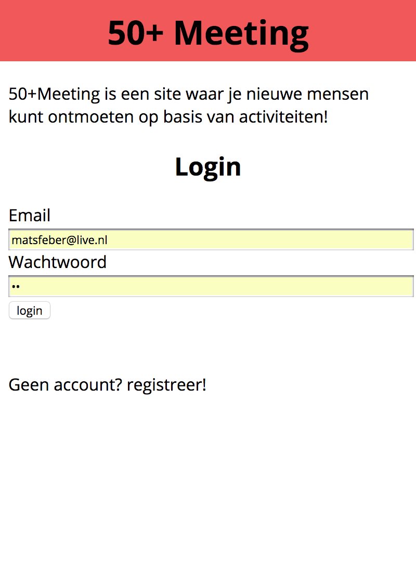
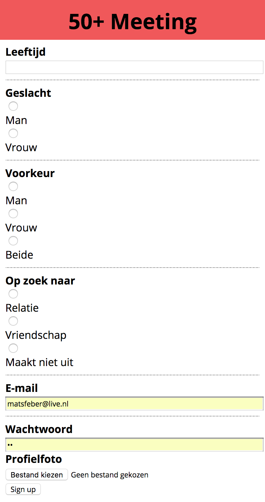
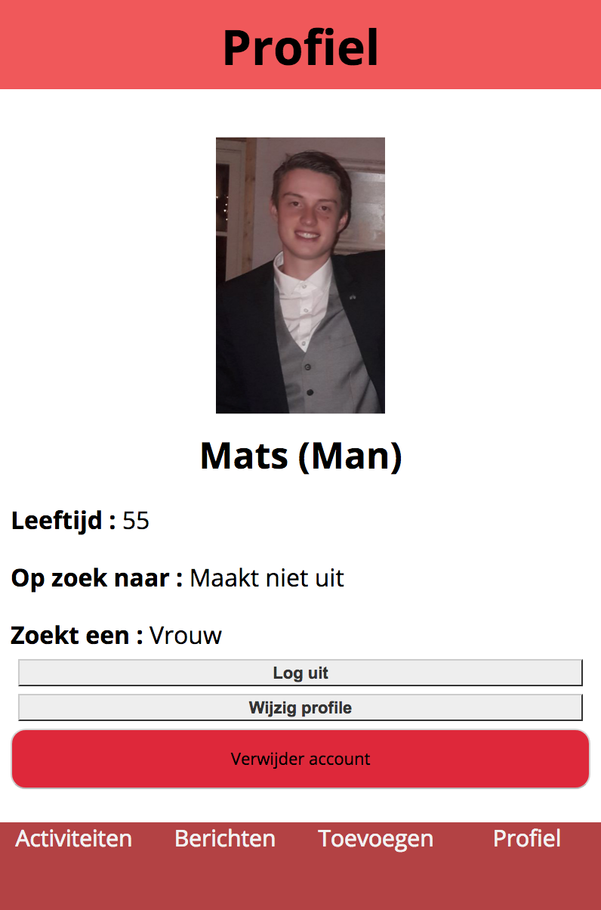
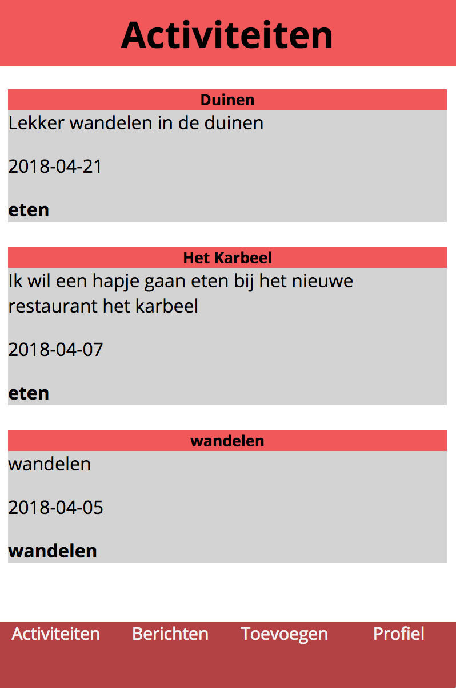
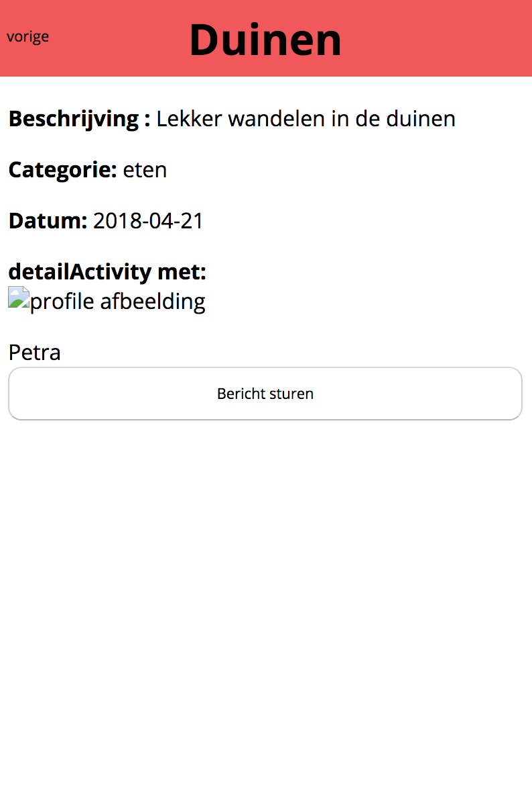
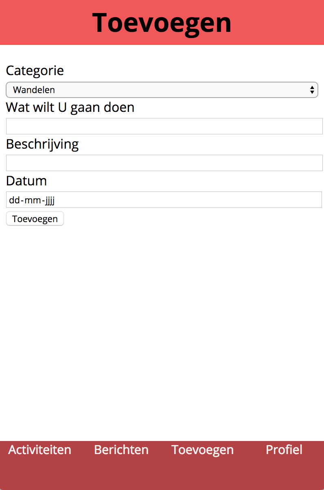

# be-assessement-2

## Meeting50+
Meeting50+ is a datingsite for people above the age of 50. Instead of matching people on appearance and interests you can create 'activitys'. When you see an activity you would like to do you can message the person that created the activity (messaging is not working yet)

The site is in dutch.

### Screens
The first screen lets you log-in or if you dont have an account yet, sign-up.


The register page looks like this, you need to fill in your name, age, gender, preference, what you are looking for, email, password and a profile picture.



After you log in you land on your own profile page.Here you can see your data and if you want you can edit it. You can also log out or delete your profile.




On the activity page you can see activitys already created. You can click on an activity and see some more data. If you are interested you can send the creator of the activity a message (unfortunately messaging is not working yet)




You can navigate to "toevoegen" to add an activity



### Install

Follow the following steps to install 50+Meeting

1. Open your terminal
2. Redirect to where you want to install 50+Meeting
3. Clone the repository with the following code
```

```
