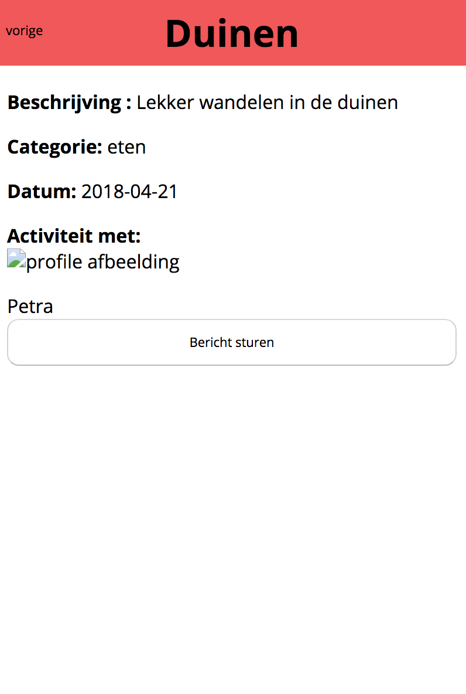

# be-assessement-2

## Meeting50+
Meeting50+ is a datingsite for people above the age of 50. Instead of matching people on appearance and interests you can create 'activitys'. When you see an activity you would like to do you can message the person that created the activity (messaging is not working yet)

The site is in dutch.

### Screens
The first screen lets you log-in or if you dont have an account yet, sign-up.
<kbd>

</kbd>

The register page looks like this, you need to fill in your name, age, gender, preference, what you are looking for, email, password and a profile picture.

<kbd>

</kbd>

After you log in you land on your own profile page.Here you can see your data and if you want you can edit it. You can also log out or delete your profile.

<kbd>

 </kbd>


On the activity page you can see activitys already created. You can click on an activity and see some more data. If you are interested you can send the creator of the activity a message (unfortunately messaging is not working yet)

<kbd>

</kbd>
<kbd>

</kbd>

You can navigate to "toevoegen" to add an activity

<kbd>
 
</kbd>

### Install

Follow the following steps to install 50+Meeting

1. Open your terminal
2. Redirect to where you want to install 50+Meeting
3. Clone the repository with the following code
```
git clone https://github.com/matsfeber/be-assessement-2.git

```
4. Install the npm packages
```
npm install
```
5. Because you have installed nodemon with the packages to start the server you can just type nodemon
```
nodemon

```

### Install database
I am using a mySQL database.
You still have to set-up the database follow the following steps to do so :
1. Log in to mySQL
```
mysql -u root -p
```
2. Create the database (the name has to be mydatesite because that is what the server connects to)
```
CREATE DATABASE IF NOT EXISTS mydatesite;
```
3. Use the database
```
CREATE DATABASE IF NOT EXISTS mydatesite;
```
4. Now you have to create 2 tables
  Table 1 :
  ```
  CREATE TABLE IF NOT EXISTS users (
  id INT NOT NULL AUTO_INCREMENT,
  name TEXT CHARACTER SET utf8,
  age TEXT CHARACTER SET utf8,
  sex TEXT CHARACTER SET utf8,
  preference TEXT CHARACTER SET utf8,
  wants TEXT CHARACTER SET utf8,
  email TEXT CHARACTER SET utf8,
  password TEXT CHARACTER SET utf8,
  img TEXT CHARACTER SET utf8,
  PRIMARY KEY (id)
);
  ```
  Table 2 :
  ```
  CREATE TABLE IF NOT EXISTS activity (
  id INT NOT NULL AUTO_INCREMENT,
  title TEXT CHARACTER SET utf8,
  description TEXT CHARACTER SET utf8,
  date TEXT CHARACTER SET utf8,
  category TEXT CHARACTER SET utf8,
  createdBy TEXT CHARACTER SET utf8,
  PRIMARY KEY (id)
);
```

### Use 50+Meeting
Now you are ready to use the site, go to http://localhost:1905/. You can change the port in the index.js file if you want to.

## Licence

[MIT]()
